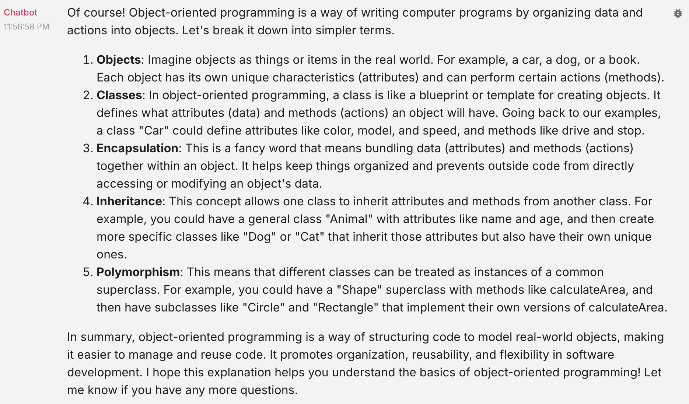

Check out the configuration reference at https://huggingface.co/docs/hub/spaces-config-reference

##### 🏗️ Activity #1:

Please evaluate your system on the following questions:

1. Explain the concept of object-oriented programming in simple terms to a complete beginner.
   - Aspect Tested:
     Ability to use explain a concept using simple language and appropriate examples
   - Result:
     
2. Read the following paragraph and provide a concise summary of the key points…
   - Aspect Tested:
3. Write a short, imaginative story (100–150 words) about a robot finding friendship in an unexpected place.
   - Aspect Tested:
4. If a store sells apples in packs of 4 and oranges in packs of 3, how many packs of each do I need to buy to get exactly 12 apples and 9 oranges?
   - Aspect Tested:
5. Rewrite the following paragraph in a professional, formal tone…
   - Aspect Tested:
