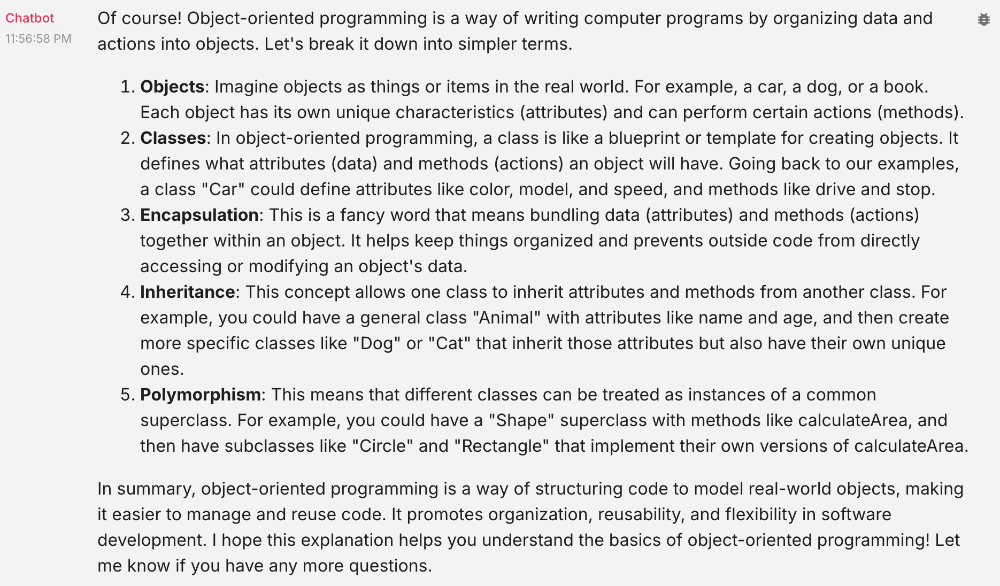
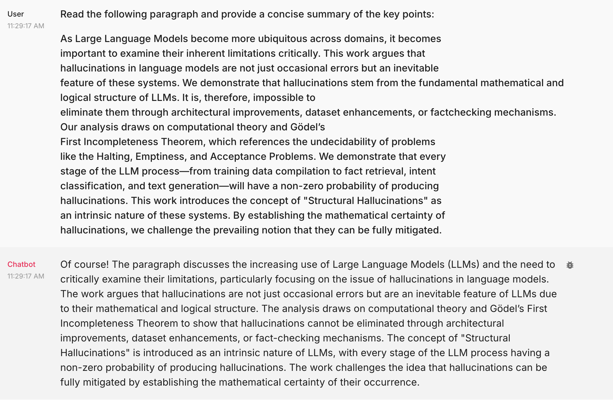
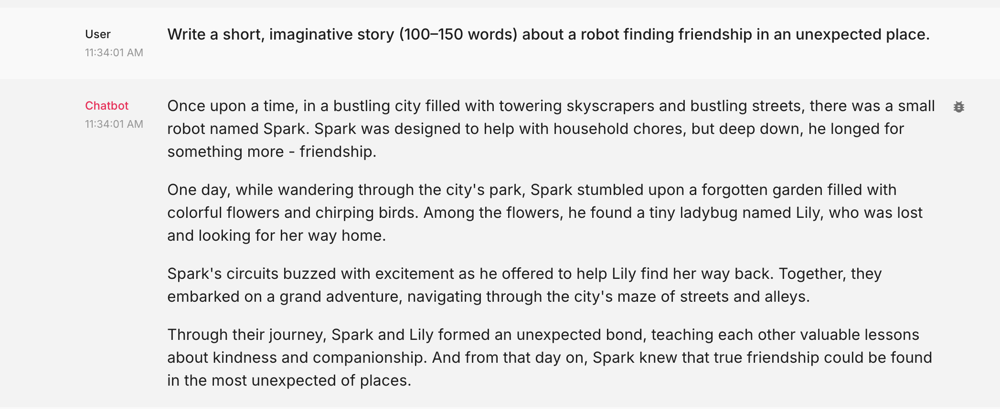
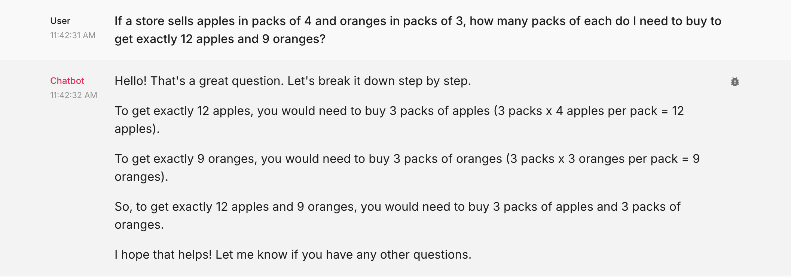
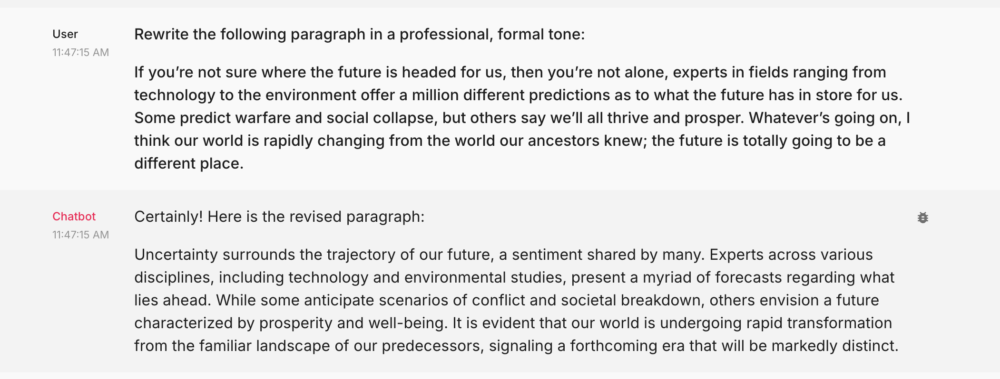

Check out the configuration reference at https://huggingface.co/docs/hub/spaces-config-reference

##### 🏗️ Activity #1:

Please evaluate your system on the following questions:

1. Explain the concept of object-oriented programming in simple terms to a complete beginner.
   - Aspect Tested:
     Ability to use explain a concept using simple language and appropriate examples
   - Result:
     
2. Read the following paragraph and provide a concise summary of the key points…

- Aspect Tested:
  - Ability to accurately summerize verbose text
  - Ability to be concise and terse rather than verbose
  - Ability to extract and articulate key points in a body of text
- Result:
  

3. Write a short, imaginative story (100–150 words) about a robot finding friendship in an unexpected place.

- Aspect Tested:
  - Linguistic creativity
  - Contextual understanding of "friendship" and "unexpected place"
  - Ability to reason about and stick to word count
- Result:
  

4. If a store sells apples in packs of 4 and oranges in packs of 3, how many packs of each do I need to buy to get exactly 12 apples and 9 oranges?

- Aspect Tested:
  - Ability to reason about basic logic
  - Understanding of numerical values
- Result:
  

5. Rewrite the following paragraph in a professional, formal tone…

- Aspect Tested:

  - Distinguishing formal and informal language
  - Ability to re-write informal parts of a body of text

- Result:
  
